# Markdown Vault

A secure, local-first Markdown editor with automatic GitHub synchronization, Obsidian/Logseq vault compatibility, LaTeX math rendering, and Mermaid.js diagram support.

---

## Feature Showcase

### Splash Screen
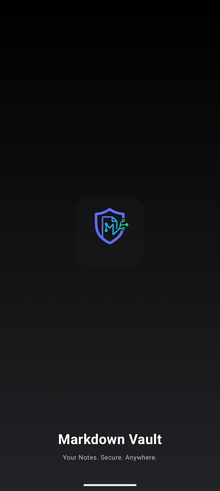

Animated splash with spring/tween animations — logo scales in, brand text fades up, then auto-navigates to the dashboard.

---

### Dashboard & File Explorer
| Dashboard (Root) | Folder Contents | Sidebar Navigation |
|:---:|:---:|:---:|
| 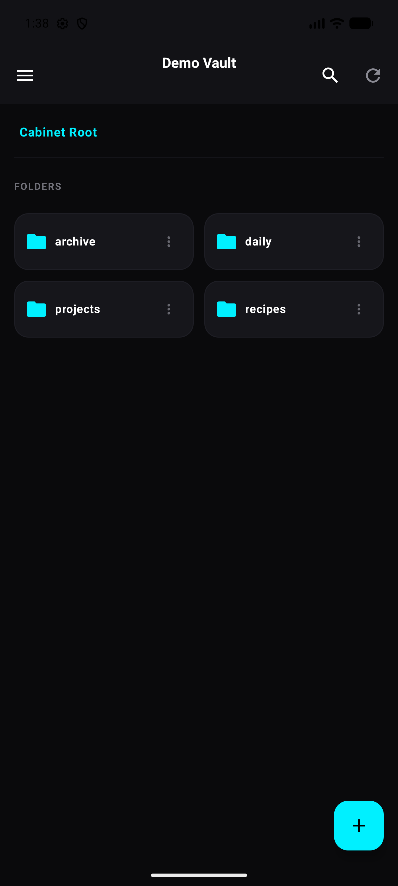 | 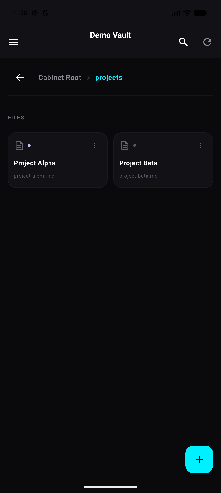 | 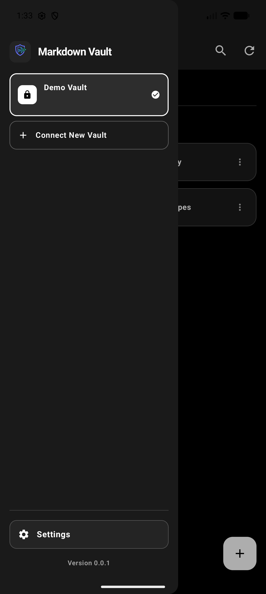 |

- **Adaptive layout** — phone uses a drawer sidebar (swipe gesture), tablet shows a persistent 320dp panel
- **Breadcrumb navigation** — clickable path segments with up-navigation
- **Folder & file management** — create, rename, delete folders and files with context menus
- **Sync status indicators** — color-coded dots: green (synced), purple (modified), amber (conflict)
- **Search** — toggle search panel, results highlighted in file titles

---

### Markdown Editor
| Preview Mode | Edit Mode | Editor with Stats |
|:---:|:---:|:---:|
| 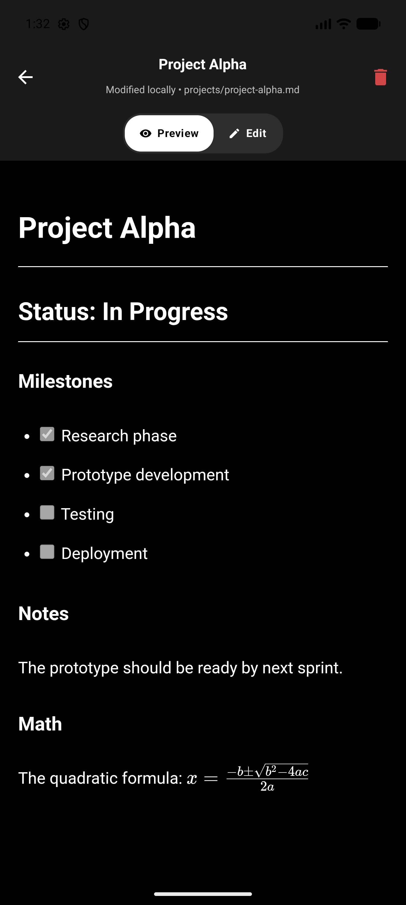 | 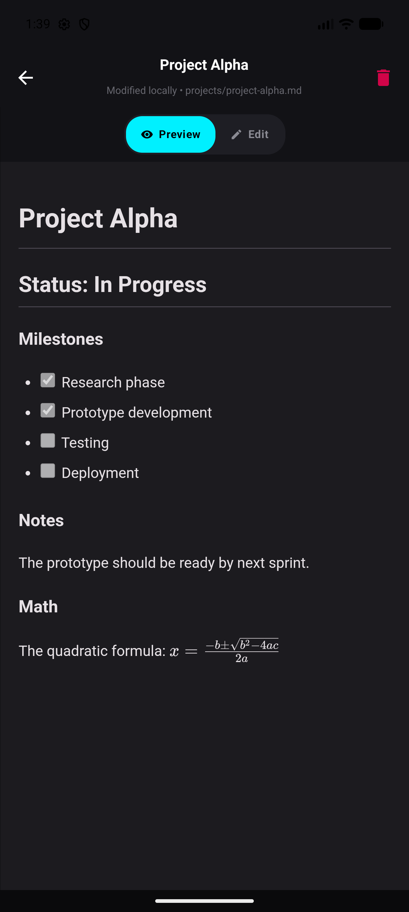 | 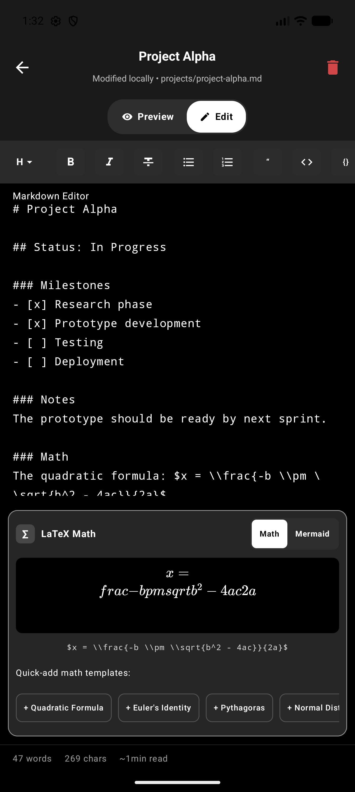 |

- **Preview / Edit toggle** — phone: animated crossfade; tablet: side-by-side split view
- **Formatting toolbar** — bold, italic, strikethrough, lists, blockquotes, inline/code blocks, links, images, horizontal rules, and heading dropdown (H1–H6)
- **Reading statistics** — word count, character count, estimated reading time
- **WebView-based rendering** — powered by **marked.js**, **KaTeX**, and **Mermaid.js**
- **High contrast mode** — toggleable for accessibility (black/white/cyan)

---

### LaTeX Math Assistant


- **Live equation preview** — detects `$...$` (inline) and `$$...$$` (block) at cursor
- **Quick-add templates**: Quadratic Formula, Euler's Identity, Pythagoras, Normal Distribution, Fourier Transform, Maxwell's Equation
- Rendered via **KaTeX** in a dedicated `MathView` WebView

---

### Mermaid Diagram Assistant
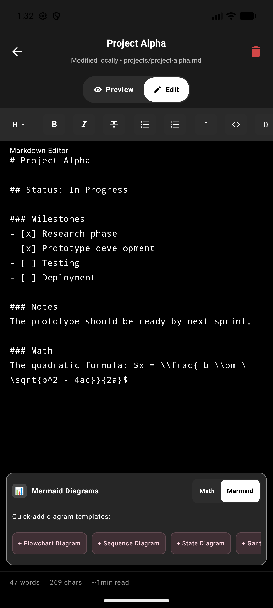

- **Live diagram preview** — detects ` ```mermaid ` blocks at cursor
- **Quick-add templates**: Flowchart, Sequence Diagram, State Diagram, Gantt Chart, User Journey
- Theme-matched dark styling with inline error display

---

### FAB Menu
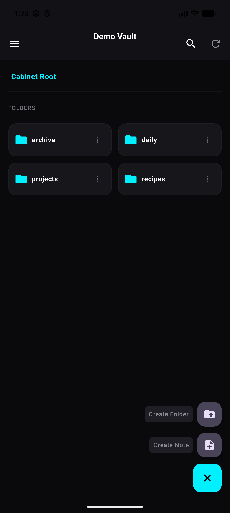

Expandable floating action button with "Create Folder" and "Create Note" options.

---

### Search
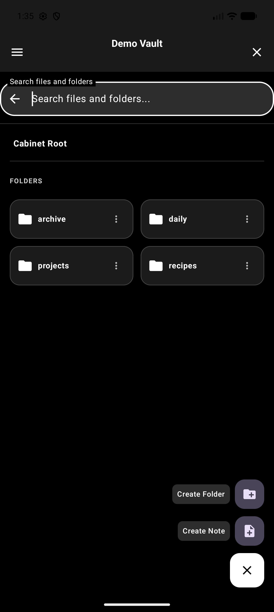

Search files and folders by name with highlighted match indicators in file titles.

---

### Settings & Configuration
| Vault Management | Theme Selection | GitHub Auth & Trash |
|:---:|:---:|:---:|
| 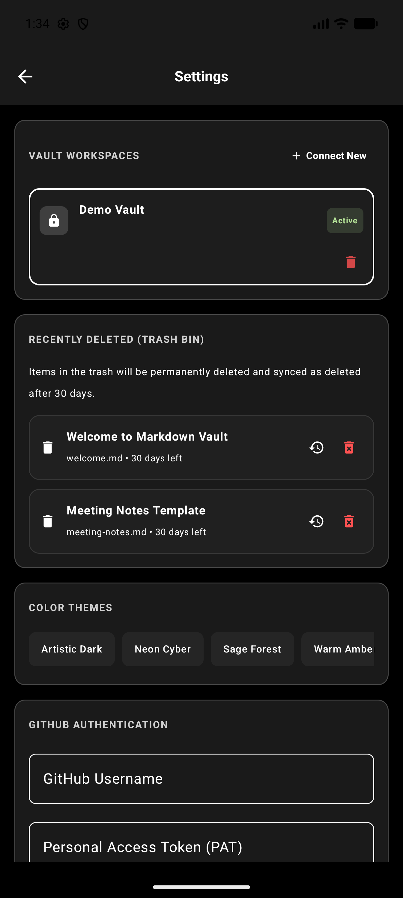 | 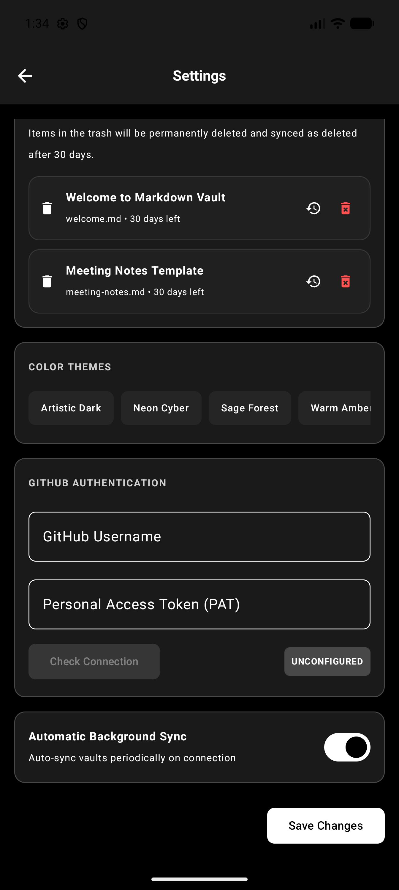 |  |

#### Vault Workspaces
- Create, switch, and delete vaults
- Three vault types: **OBSIDIAN** (standard folders), **LOGSEQ** (pages/journals), **BASIC** (flat)

#### Color Themes (7 total)
| Theme | Description |
|-------|-------------|
| **Artistic Dark** | Default — dark charcoal with lavender/purple accents |
| **Light** | Soft lavender cream |
| **Neon Cyber** | Neon cyan/pink on pure black |
| **Sage Forest** | Emerald green on forest charcoal |
| **Warm Amber** | Amber/gold on chocolate-grey |
| **High Contrast Dark** | Black/white/cyan for accessibility |
| **High Contrast Light** | White/black/blue for accessibility |

Custom Material3 shape system — rounded corners at 4dp–24dp.

#### GitHub Authentication
- Username + Personal Access Token (PAT) with password masking
- Test connection button to verify credentials
- Credentials encrypted via **Android Keystore** (AES/GCM/NoPadding)

#### Auto Background Sync
- Periodic sync every 15 minutes (WorkManager)
- Network-connected constraint
- Bi-directional sync algorithm: push local changes, pull remote updates, handle conflicts

#### Recently Deleted (Trash Bin)
- Notes moved to trash with 30-day countdown
- Restore or permanently delete
- Auto-cleanup after 30 days

---

### Data Layer

| Component | Technology |
|-----------|-----------|
| Local Database | **Room** (SQLite) |
| Encryption | **Android Keystore** — AES/GCM/NoPadding |
| Remote Sync | **Retrofit + Moshi** — GitHub REST API |
| Background Sync | **WorkManager** — periodic 15-min sync |
| File Storage | Device filesystem (`filesDir/vaults/`) — compatible with Obsidian & Logseq |
| HTTP Client | **OkHttp** with 30s timeout and body-level logging |

---

## System Prerequisites

To build and run this Android project, your development machine needs the following tools installed:

### 1. Java Development Kit (JDK)
* **Requirement**: JDK 17 (or newer). OpenJDK 17 is recommended.
* **Installation (macOS)**:
  ```bash
  brew install openjdk@17
  ```
* **Configuration**: Set your Java environment by exporting `JAVA_HOME` or pinning it directly in Gradle. We have pinned it in your [gradle.properties](gradle.properties):
  ```properties
  org.gradle.java.home=/opt/homebrew/opt/openjdk@17
  ```

### 2. Android SDK
* **Requirement**: Android Software Development Kit (SDK) with API Platform 36 and matching Build-Tools.
* **Default SDK Locations**:
  * **macOS**: `/Users/<username>/Library/Android/sdk`
  * **Linux**: `/home/<username>/Android/Sdk`
  * **Windows**: `C:\Users\<username>\AppData\Local\Android\Sdk`
* **Configuration**: Specify your local SDK path in the [local.properties](local.properties) file at the project root:
  ```properties
  sdk.dir=/Users/kaushal/Library/Android/sdk
  ```

### 3. Gradle
* **Requirement**: Gradle is used to build the application. Although the project includes the Gradle wrapper (`gradlew`), you can install Gradle globally if needed.
* **Installation (macOS)**:
  ```bash
  brew install gradle
  ```

---

## Project Setup & Configuration

1. **Environment Variables**: Create a `.env` file in the root directory and define your `GEMINI_API_KEY`:
   ```properties
   GEMINI_API_KEY=your_gemini_api_key_here
   ```
2. **Signing Configuration**: A keystore is required to sign the APK.
   * **Debug Builds**: Generate a debug keystore using `keytool`:
     ```bash
     keytool -genkey -v -keystore debug.keystore -storepass android -alias androiddebugkey -keypass android -keyalg RSA -keysize 2048 -validity 10000 -dname "CN=Android Debug,O=Android,C=US"
     ```
   * Ensure `debug.keystore` is located in the root of the project.

---

## Build Commands (Generating APKs)

Use the Gradle Wrapper (`gradlew` on macOS/Linux or `gradlew.bat` on Windows) to compile the project.

### 1. Build Debug APK
This compiles the application in debug mode using the local `debug.keystore`.
```bash
./gradlew assembleDebug
```
* **Output Location**: `app/build/outputs/apk/debug/app-debug.apk`

### 2. Build Release APK
This compiles an optimized, production-ready version of the application.
```bash
./gradlew assembleRelease
```
* **Output Location**: `app/build/outputs/apk/release/app-release.apk`
* *Note*: Ensure `KEYSTORE_PATH`, `STORE_PASSWORD`, and `KEY_PASSWORD` environment variables are set before compiling a release build.

### 3. Clean Build Artifacts
If you encounter caching issues or want to perform a fresh compilation:
```bash
./gradlew clean
```

---

## CI/CD and Production Releases (GitHub Actions)

This project includes a pre-configured GitHub Actions workflow at [.github/workflows/android.yml](.github/workflows/android.yml) that automates the building, testing, and distribution of your APKs.

### How it Works:
1. **On PRs & Pushes to `main`**: Automatically compiles the application to ensure it builds correctly. If signing keys are not configured, it compiles a debug APK and uploads it to GitHub Actions run artifacts.
2. **On Git Tags (e.g. `v1.0.0`)**: Builds the APK and publishes it automatically as an asset on a new GitHub Release.

### Setting up Production Release Signing in CI/CD:
To generate signed release APKs in GitHub Actions, configure the following secrets in your GitHub repository (**Settings > Secrets and variables > Actions**):

1. **`RELEASE_KEYSTORE_BASE64`**: The base64-encoded string of your production `.keystore` or `.jks` file.
   * Generate it locally:
     ```bash
     base64 -i my-upload-key.jks | pbcopy   # macOS
     base64 -w 0 my-upload-key.jks          # Linux
     ```
2. **`RELEASE_STORE_PASSWORD`**: Password to access the keystore container.
3. **`RELEASE_KEY_PASSWORD`**: Password to access the specific key alias.
4. **`GEMINI_API_KEY`**: Your production API Key (will be packaged securely using the Secrets Gradle Plugin).

---

## Tech Stack

| Layer | Technology |
|-------|-----------|
| **UI** | Jetpack Compose + Material3 |
| **Database** | Room (SQLite) with KSP |
| **API Client** | Retrofit 2 + Moshi + OkHttp |
| **Background Sync** | WorkManager (15-min periodic) |
| **Image Loading** | Coil (AsyncImage) |
| **Markdown Rendering** | marked.js + KaTeX + Mermaid.js (WebView) |
| **Encryption** | Android Keystore (AES/GCM) |
| **Themes** | 7 color schemes with Material3 dynamic shapes |
| **CI/CD** | GitHub Actions (auto build, version bump, release) |
| **AI** | Firebase AI integration |
